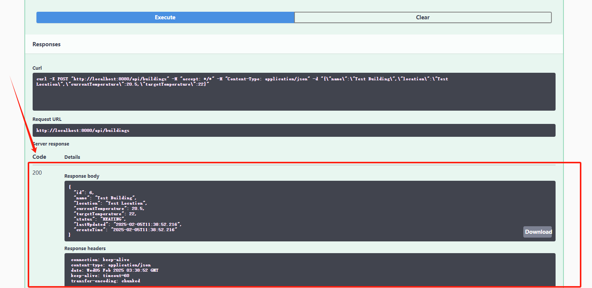

# Building Temperature Control System

A REST API-based system for controlling and monitoring building temperatures. This project is built using Spring Boot, MyBatis, and MySQL.

## Technologies Used

- Java 8
- Spring Boot 2.7.5
- MyBatis
- MySQL 8.0
- Swagger 3.0.0
- Maven

## Prerequisites

- JDK 1.8
- Maven 3.x
- MySQL 8.0

## Database Setup

1. Make sure MySQL is running on port 3306
2. Use the following credentials:
   - Username: root
   - Password: root
3. Run the SQL script located at `src/main/resources/db/init.sql` to create the database and tables

```sql
mysql -u root -p < src/main/resources/db/init.sql
```

## Building and Running the Application

1. Clone the repository
2. Navigate to the project directory
3. Build the project:
```bash
mvn clean install
```
4. Run the application:
```bash
mvn spring-boot:run
```

The application will start on port 8080.

## API Documentation

Swagger UI is available at: http://localhost:8080/swagger-ui/

## Testing Steps

1. Start the application using `mvn spring-boot:run`
2. Initialize the database using the provided SQL script
3. Test the API endpoints in the following order:
   - Create a new building using the POST endpoint
   - Verify the building was created using GET all buildings
   - Get the specific building using its ID
   - Update the building's temperature
   - Verify the temperature was updated
   - Delete the building
   - Verify the building was deleted

## API Endpoints and Testing

### 1. Get All Buildings

(1) Click "Try it out".


(2) Click "Execute".


(3) Show all results.


### 2. Create a Building

(1) Add the json request body:


(2) Execute and show results:




### 3. Get Building by ID

(1) Enter the building's id:


(2) Execute and show results:


### 4. Update Building Temperature

(1) Enter the building's id, and update its' targetTemperature.


(2) Execute and show results:


### 5. Delete Building

(1) Enter the building's id which you need delete.


(2) Execute and show results:


